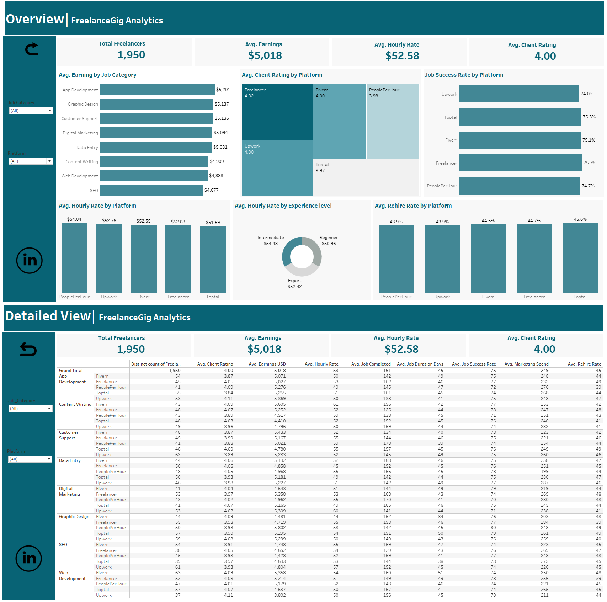

# 📊 FreelanceGig Analytics

---

## 📚 Table of Contents
- [Project Overview](#-project-overview)
- [Business Problem](#-business-problem)
- [Project Objectives](#-project-objectives)
- [Methodology](#-methodology)
- [Key Findings](#-key-findings)
- [Summary](#-summary)
- [Recommendations](#-recommendations)
- [Tools & Technologies](#-tools--technologies)
- [Interactive Dashboard](#-interactive-dashboard)
- [License](#-license)
- [Contact](#-contact)

---

## 📘 Project Overview
**FreelanceGig Analytics** is a comprehensive Tableau project that explores trends, earnings, performance metrics, and client behaviour across major freelance platforms. The goal is to provide actionable insights for freelancers, clients, and policymakers navigating the rapidly expanding gig economy.

---

## ❗ Business Problem
The gig economy is growing, but clients often struggle to identify the most effective platforms for hiring qualified freelancers. Key challenges include:

- Variations in freelancer performance across platforms  
- Earnings disparities by job category and experience level  
- Inconsistent client satisfaction and rehire patterns  
- Difficulty optimising job matching and compensation strategies  

This project addresses these gaps through data‑driven analysis and interactive visualisation.

---

## 🎯 Project Objectives
- Analyse freelancer job trends across multiple platforms  
- Assess earnings by job category and experience level  
- Identify key success factors influencing platform performance  
- Build interactive Tableau dashboards for deeper exploration  

---

## 🔄 Methodology

### **Data Processing Workflow**
1. **Data Importation** – Load datasets into Tableau  
2. **Data Integration** – Join multiple tables for unified analysis  
3. **Visualisation Creation** – Build charts and graphs to uncover insights  
4. **Dashboard Development** – Design interactive dashboards  
5. **Insights & Recommendations** – Translate findings into actionable guidance  

---

## 📈 Key Findings

### 💰 Earnings Analysis
- **Highest‑earning category:** App Development — *$5,201 average*  
- **Lowest‑earning category:** SEO — *$4,677 average*  

### 🧠 Experience Level Impact
- **Intermediate freelancers** earn *$2+ more per hour* than experts  
- **Beginners** earn the lowest hourly rates  

### ⏱️ Hourly Rate by Platform
- **PeoplePerHour** has the highest average hourly rate  
- **Toptal** has the lowest hourly rate  

### 🏆 Platform‑Specific Insights
- **Client Ratings:** Freelancer (4.02) and Upwork (4.0) lead  
- **Success Rates:** All platforms maintain *74%+* success rates  
- **Rehire Patterns:** Toptal leads despite lower ratings — likely due to affordability  

---

## 📝 Summary
This analysis evaluates freelancer performance across major gig platforms to uncover patterns in earnings, ratings, and rehire behaviour.  
Key insights include:

- App Development is the most lucrative category  
- Intermediate freelancers outperform experts in hourly earnings  
- Toptal achieves the highest rehire rates despite lower ratings  
- All platforms maintain strong success rates, making platform selection a strategic decision for both freelancers and clients  

---

## 💡 Recommendations

### ✔ For Freelancers
- Target high‑earning categories like **App Development** and **Graphic Design**  
- Choose platforms such as **Freelancer** and **PeoplePerHour** for higher success rates  
- Invest in upskilling to move from **Beginner → Intermediate**  
- Use experience level strategically when negotiating rates  

### ✔ For Clients
- Prioritise platforms with strong success rates (Freelancer, PeoplePerHour)  
- Evaluate freelancers based on historical performance data  
- Consider **Toptal** for cost‑effective hiring with strong rehire potential  

### ✔ For Stakeholders
- Standardise job evaluation metrics across platforms  
- Improve transparency in performance reporting  
- Support training initiatives for beginner freelancers  

---

## 🛠️ Tools & Technologies
- **Data Cleaning:** Microsoft Excel  
- **Data Visualisation:** Tableau  

---

## 🌐 Interactive Dashboard
Explore the full interactive Tableau dashboard here:  
🔗 **https://public.tableau.com/app/profile/fadekemi.adefemi/viz/FreelanceGigAnalyticsDashboard/OverviewFreelanceGigAnalyticsDashboard**

---

## 📄 License
This project is licensed under the **MIT License**.  
See the [LICENSE](./LICENSE) file for full details.

---

## 📬 Contact
For questions or collaboration opportunities:

- **LinkedIn:** https://www.linkedin.com/in/fadekemi-adefemi0129/  
- **Email:** Fadekemiadefemi22@gmail.com  
- **GitHub:** https://github.com/Fadekemi29/  
